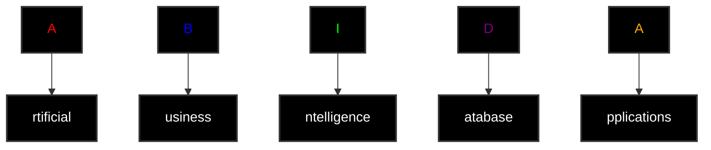

# Abida.jl
Improved trial from Snild.jl

```mermaid
graph TD;
    A1[A]:::red;
    A2[rtificial];
    B1[B]:::blue;
    B2[usiness];
    C1[I]:::green;
    C2[ntelligence];
    D1[D]:::purple;
    D2[atabase];
    E1[A]:::orange;
    E2[pplications];

    A1 --> A2;
    B1 --> B2;
    C1 --> C2;
    D1 --> D2;
    E1 --> E2;

    classDef red fill:#000,stroke:#333,stroke-width:2px,color:#f00;
    classDef blue fill:#000,stroke:#333,stroke-width:2px,color:#00f;
    classDef green fill:#000,stroke:#333,stroke-width:2px,color:#0f0;
    classDef purple fill:#000,stroke:#333,stroke-width:2px,color:#800080;
    classDef orange fill:#000,stroke:#333,stroke-width:2px,color:#ffa500;
    classDef default fill:#000,stroke:#333,stroke-width:2px,color:#fff;

    class A2,B2,C2,D2,E2 default;

```
