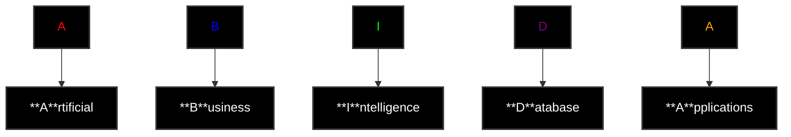

# Abida.jl
Improved trial from Snild.jl

### Abida can also mean : "I am Your Father" or "It is an App" in Korean  "니 애비다" or "앱이다" respectively 😆

## how to use it ? 
clone it and run the module and run the example , simple as that
